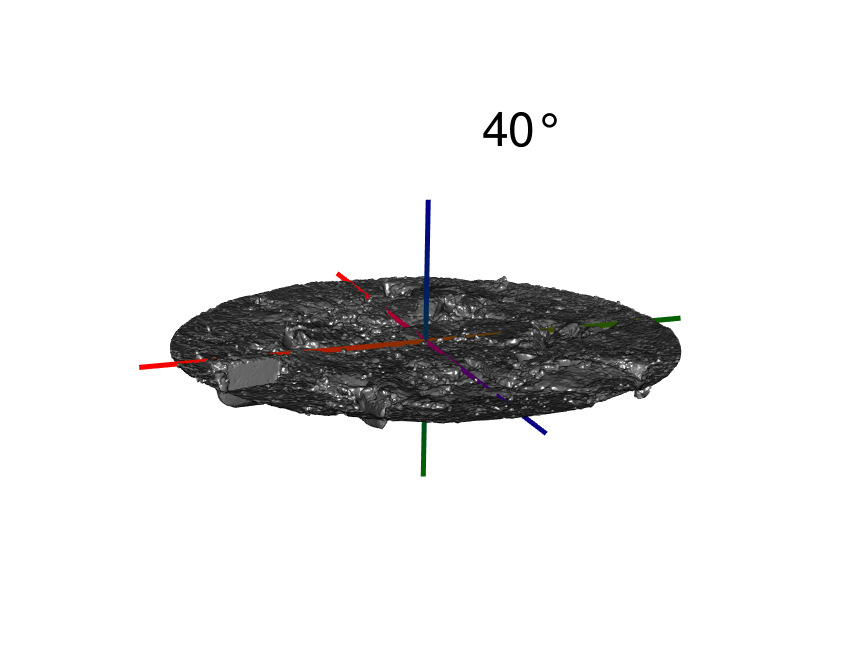

# Make sure pre-processing is consistent 


```{r setup, include=F}

# from https://bookdown.org/yihui/rmarkdown-cookbook/hook-truncate.html

# save the built-in output hook
hook_output <- knitr::knit_hooks$get("output")

# set a new output hook to truncate text output
knitr::knit_hooks$set(output = function(x, options) {
  if (!is.null(n <- options$out.lines)) {
    x <- xfun::split_lines(x)
    if (length(x) > n) {
      # truncate the output
      x <- c(head(x, n), "....\n")
    }
    x <- paste(x, collapse = "\n")
  }
  hook_output(x, options)
})


knitr::opts_knit$set(root.dir = getwd())
knitr::opts_chunk$set(dev = 'svglite',
                      fig.asp = 9/16)
pkgs <- c("tidyverse", "cowplot", "fs", "Rvcg", "Morpho", "molaR", "soilmesh",
          "patchwork", "broom", "magick", "pander", "kableExtra")

# load any packages which are not already loaded

xfun::pkg_attach(pkgs[!pkgs %in% (.packages())])

theme_set(theme_cowplot() %+replace%
          theme(
            axis.text.x = element_text(size = 9, hjust = 0.5, margin = margin(t= 14/4)),
            axis.text.x.top = element_text(size = 9, hjust = 0.5, margin = margin(t= 14/4)),
            axis.text.y = element_text(size = 9, hjust = 0.5, margin = margin(t= 14/4)),
            axis.text.y.right = element_text(size = 9, hjust = 0.5, margin = margin(t= 14/4))
)
)


```





```{r copy-images-to-Rmd-directory, include=F}
imgs <- here::here(c("images/rgl-snapshots/downsampled-tile-montage.png",
              "images/illustrations/scanner-angle-shadows/40-deg-shadow.svg",
              "images/illustrations/scanner-angle-shadows/40-deg-shadow.png",
          "data/proposed-experiments-data/3D-scanning-data/verifying-rt-matrices-for-scanner-angle-calibration/all-rt-matrices-worked.gif"))

imgs
if(sum(file.exists(basename(imgs))) < length(imgs)){
# fs::file_copy(imgs,
#               new_path = "misc-EDA/",
#               overwrite = T
#               )
  
purrr::map(imgs, fs::file_copy, new_path = here::here("misc-EDA/"), overwrite= TRUE)
  
}
```


```{r echo=F}
xaringanthemer::style_mono_light(
  text_font_google = xaringanthemer::google_font('Roboto Condensed'),
  header_font_google = xaringanthemer::google_font('Roboto Condensed')
  )
```

```{css, echo=F}

pre code {
  white-space: pre-wrap;
}

.red{
  color: red;
}
# 
# .top-header {
#   padding: 1px;
#   text-align: center;
#   background-color: white;
# }
# 
# .top-header .remark-slide-content h1 {
# 	font-size: 55px;
# 	background-color: #c0c0c0;
# 	margin-top: 0.5px;
# }
```

```{r find-copy-import-data, include=F}


# copy files from scanner-angle-calibration project, which was built with the
# targets package

files <- list.files(path = "../../data-lab/scanner-angle-calibration/analysis/data/derived_data/", 
                    pattern = "[.]csv", full.names = T)

if(sum(file.exists(files)) == 0){
  file_copy(files, new_path = "data/proposed-experiments-data/3D-scanning-data/",
            overwrite = T)
}

# import files and hold in a list 

dfnames <- list.files(path = "data/proposed-experiments-data/3D-scanning-data/",
                      pattern = "\\.csv", full.names = T)%>% 
  basename() %>% 
  str_replace_all(string = ., 
                  pattern = "-",
                  replacement = "_") %>% 
  str_replace(string = ., pattern = "\\.csv",
              replacement = "")

datafiles <- list.files(path = "data/proposed-experiments-data/3D-scanning-data/",
                        pattern = "\\.csv", full.names = T) %>% 
  purrr::set_names(nm = dfnames) %>% 
  purrr::map(readr::read_csv)


# assign all files as individual objects 

list2env(datafiles, envir = globalenv())

# adjust a couple columns for later use in plotting 

angle_colors <- tibble(
  angle = seq(40, 80, 10),
  color = c('firebrick', rep('grey75', 4))
)

dne_by_angle_and_faces <- dne_by_angle_and_faces %>%
  mutate(cylinder_ID = fct_reorder(cylinder_ID, surface_dne, .fun = max),
         angle_color_label = if_else(angle == 40,
                               '40\u00b0', 'Other')) %>%
  left_join(angle_colors, by = 'angle')

```


```{r eval= Sys.Date() <= "2021-03-20", include=F}
faces <- rev(1000*c(1000, 500, 250, 100, 50, 25, 10, 5, 1))


# this step is only needed today until I re-run the targets 
# pipeline....I forgot to keep the faces in the data frame derived 
# from the run

dne_by_angle_and_faces <- dne_by_angle_and_faces %>%
  mutate(faces = rep(faces, 
                     times = length(dne_by_angle_and_faces$surface_dne) / length(faces)))


```


```{r plot-fn-for-dne-vs-faces, echo=F}
dne_by_angle_plot <- function(df){
  ggplot(df, aes(faces/1000, surface_dne, color = factor(angle)))+
    geom_line(show.legend = F, alpha = 2/3)+
    geom_point(alpha = 2/3)+
    scale_x_continuous("Number of faces (thousands)")+
    scale_y_continuous("Surface DNE", 
                       labels = scales::label_comma())+
    colorblindr::scale_color_OkabeIto()+
    guides(color = guide_legend(
      title = stringr::str_c("Scanner", "angle (\u00b0)", sep =  "\n"), 
      title.position = 'top',
      direction = "vertical", title.hjust = 0.5))
  
}

# to permit aesthetics to be altered by color 
dne_by_angle_plot_lumped <- function(df, ...){
  ggplot(df, aes(faces/1000, surface_dne, ...))+
    geom_line(show.legend = F, alpha = 2/3)+
    geom_point(alpha = 2/3)+
    scale_x_reverse("Number of faces (thousands)")+
    scale_y_continuous("Surface DNE", 
                       labels = scales::label_comma())+
    colorblindr::scale_color_OkabeIto()+
    guides(color = guide_legend(
      title = stringr::str_c("Scanner", "angle (\u00b0)", sep =  "\n"), 
      title.position = 'top',
      direction = "vertical", title.hjust = 0.5))
  
}

```


---

background-image: url("downsampled-tile-montage.png")
background-size: contain

---

# Mesh decimation has trade-offs

.pull-left[
- DNE is computationally expensive 

- 30-50 MB per file (~ 1,500,000 faces)

- raw files can't be analyzed in-memory


```{r show-dne-error, eval=F}
mesh <- vcgImport(raw_mesh_file) 
DNE(mesh)
```

.red[
```{r print-error-message, echo=F}
message("Error: cannot allocate vector of size 15800.4 Gb")
```
]

- how much to reduce without losing information?

]

```{r assign-var-to-large-mesh-path, include=F}
raw_mesh_file <- "./data/proposed-experiments-data/3D-scanning-data/a-single-large-processed-mesh.ply"
```


.pull-right[

```{r start-time, echo=F}
tictoc::tic(msg = "Operation completed...\nRun time was")
```

```{r show-face-reduction-code, out.lines = 4, highlight.output = 1}
# reduce to 10,000 faces before calculation

mesh <- vcgImport(raw_mesh_file) %>% 
  vcgQEdecim(tarface = 10e3) %>% 
  vcgClean(sel = c(2,1,4), 
           iterate = T, silent = T) %>%
  updateNormals() 

```

```{r results='hide'}
DNE(mesh)
```


```{r, echo=F, highlight.output = 1}
message("## Total Surface DNE = 3043.894")
```


```{r end-time, echo=F}
tictoc::toc()
```

]


---

```{r outlier-is-40-deg-facets, message= F, echo=F, warning=F, fig.asp=9/16}

dne_by_angle_and_faces_plots <- dne_by_angle_and_faces %>% 
  filter(faces < 100e3) %>%
  mutate(cylinder_ID = paste0("Sample ", cylinder_ID)) %>% 
  dne_by_angle_plot_lumped(color = color, group = angle)+
  scale_color_identity(guide = "color",
                       labels = unique(dne_by_angle_and_faces$angle_color_label))+
  guides(color = guide_legend(title = 'Scanner angle', title.hjust = 0.5))+
  facet_wrap(~cylinder_ID)+
  ggtitle("40\u00b0 stands out from the other angles")+
  theme(strip.background = element_blank(),
        strip.text = element_blank(),
        legend.position = 'top')

dne_by_angle_and_faces_plots
```

---
background-image: url("40-deg-shadow.svg")
background-position: bottom
background-size: contain

# Shadow @ low angle

- Can't see the back side of the clods? Interpolates straight plane down to the surface?

---

# Fit a simple linear model 

- Log-transform # of faces 

```{r trim-out-40-and-50-degrees, include=F}
sans_4050 <- dne_by_angle_and_faces %>% 
  filter(!angle %in% c("40", "50"), 
         faces < 100e3, 
         !is.na(surface_dne))
```


```{r fit-model-sans-40-50-deg, highlight.output = 10, out.lines = 10}
lm_sans4050 <- lm(
  data = sans_4050, 
  formula = surface_dne ~ log(faces) * cylinder_ID + angle)

```
```{r echo=F}

kbl(anova(lm_sans4050), digits = 3) %>% 
  row_spec(3, background = "#ffff88") %>% 
  kable_styling()
```

---

```{r plot-all-12-cyls, echo=F, message=F, fig.asp=9/16}
avg_across_angle_by_cylinder <- dne_by_angle_and_faces %>% 
  group_by(faces, cylinder_ID) %>% 
  summarise(surface_dne = mean(surface_dne, na.rm = T)) 


avg_per_angle_and_cylinder_plot <- avg_across_angle_by_cylinder %>% 
  drop_na() %>% 
  ggplot(aes(faces/1000, surface_dne, color = cylinder_ID))+
  geom_point(shape =1, size =2)+
  geom_line(size = 0.25)+
  scale_x_reverse("Number of faces (thousands)",
                     labels = scales::label_comma())+
  scale_y_continuous("Surface DNE", 
                     labels = scales::label_comma())+
  labs(color = "Sample",
       title = "Decimation effect for every sample, averaged over angles")+
  guides(color = guide_legend(ncol = 2, title.hjust = 0.5))

avg_per_angle_and_cylinder_plot
```


---
```{r include=F}
avgs <- dne_by_angle_and_faces %>% 
  filter(faces %in% c(50000, 25000),
           ! angle %in% c("40", "50")) %>% 
  group_by(faces) %>% 
  summarise(surface_dne = mean(surface_dne, na.rm = T))

linear_decrease <- (avgs$surface_dne[1] - avgs$surface_dne[2])  / ( avgs$faces[1] - avgs$faces[2] )
top_dne <- max(avgs$surface_dne)

```

```{r echo=F, fig.asp=9/16}
avg_across_angle_and_cyl <- dne_by_angle_and_faces %>% 
  filter(! angle %in% c("40", "50")) %>% 
  group_by(faces) %>% 
  summarise(surface_dne = mean(surface_dne, na.rm = T)) %>% 
  drop_na()

avg_across_angle_and_cyl_plot <- avg_across_angle_and_cyl %>% 
  ggplot(aes(faces/1000, surface_dne))+
  geom_point(alpha= 2/3, size = 3,  color = 'steelblue')+
  geom_line(size = 0.75, color = 'steelblue')+
  geom_abline(slope = -linear_decrease*1000, 
              intercept = 1400,
              linetype = 'longdash',
              color = 'grey50',
              size = 0.25)+
  geom_segment(aes(x= 25, xend=25, y= 0, yend= 0.9*avgs$surface_dne[1]),
               color = 'grey50',
               arrow = arrow(angle = 20, type =  'closed', length = unit(0.15, "inches")))+
  annotate("text", label =  "Minimal\ninformation\nloss at\n25,000 faces", x = 33, y = 0.9*avgs$surface_dne[1]*2/3)+
  scale_x_reverse("Number of faces (thousands)",
                     labels = scales::label_comma())+
  scale_y_continuous("Surface DNE", 
                     labels = scales::label_comma(),
                     breaks = scales::breaks_width(width = 2000, offset = 0))+
  ggtitle("A more useful plot: average decimation effect")

avg_across_angle_and_cyl_plot
```

