```{r setup, include=FALSE}
knitr::opts_chunk$set(echo = F, warning = F, message = F, out.width = "90%", fig.align = 'center')
library(magrittr)
library(xaringanExtra)
# xaringanExtra::use_tile_view()
# xaringanExtra::use_scribble()
# xaringanExtra::use_search(show_icon = TRUE, case_sensitive = FALSE, auto_search = TRUE, position = "top-right")
xaringanExtra::use_logo(image_url = "presentation-figs/psu-college-of-ag-logo.png",
                        position = css_position(bottom = "1em"))
```


.pull-left[

Co-author: Dr. Andy McNitt 


```{r out.width='50%'}

```

<br>

```{r out.width='50%'}

```

<br>


```{r out.width='50%'}

```


]


.pull-right[

Undergraduates: Ian Royer & Hunter Finn


```{r out.width='50%'}

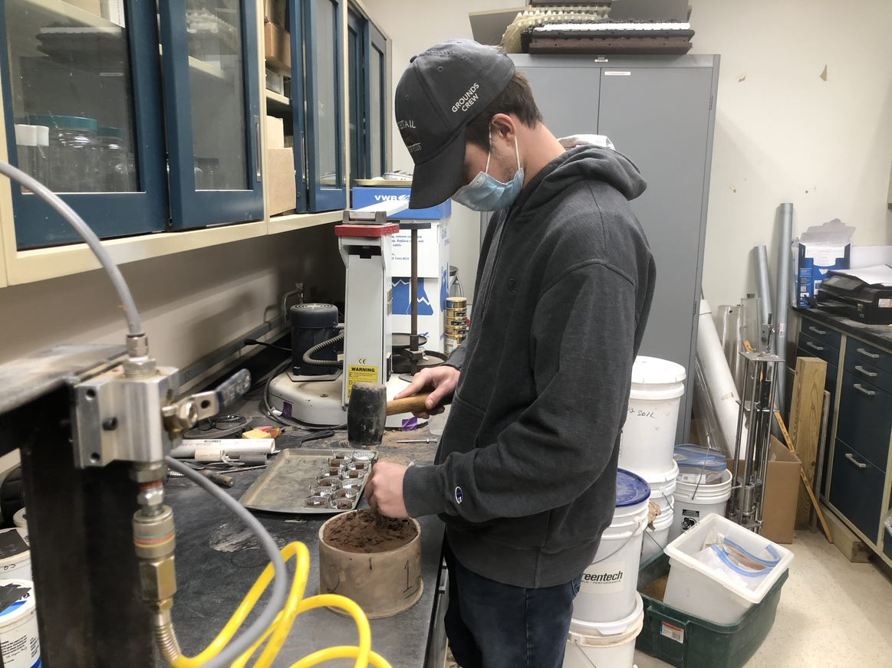

```

<br>

```{r out.width='50%'}

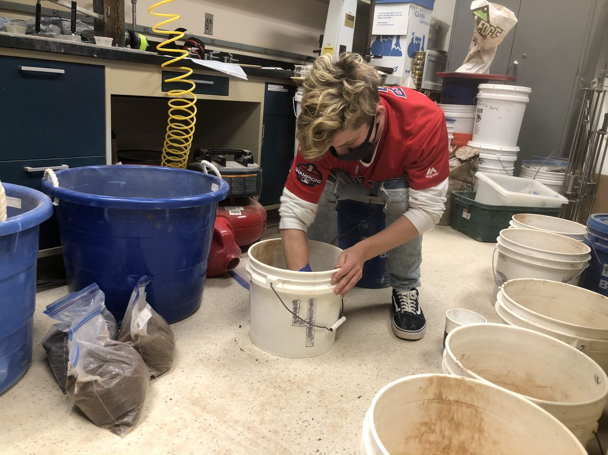

```

]

---


class: white-bg

background-image: url('https://drive.google.com/uc?id=1hFX3lZCMW5kAI1y1E577UpdmSvo8wyoF')
background-size: contain

.black[# Structure]


.black[- Problem review ]
<!-- (~3 min) -->

.black[- Objective + method development ]
 
<!-- (~7 min) -->

.black[- Proof-of-concept data + wrap-up  ]
<!-- (~3 min) -->

---
class: no-h1
background-image: url('presentation-figs/player-locations.png')
background-size: contain

# Concentration of play 

---
background-image: url('committee-meeting-2-presentation-dependencies/corkboard-concept.png')
background-size: contain


class: no-h1
# Cleat-in/cleat-out


---
class: no-h1, middle, center

# Managing water content 

.pull-left[

```{r post-game-soak, out.width='100%'}
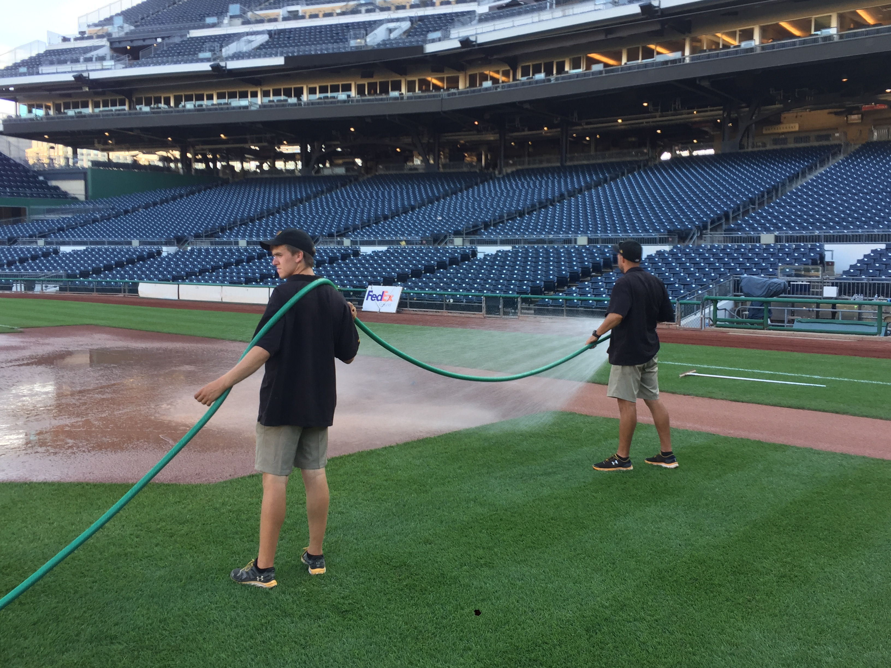
```

]

.pull-right[

```{r in-game-tarp-pull, out.width='100%'}
knitr::include_graphics('presentation-figs/in-game-pull.png')
# 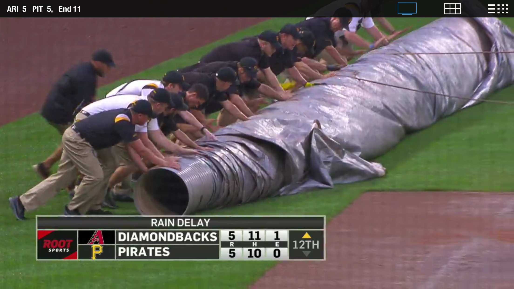
```


]


---


# Acceptable boundaries 

```{r}
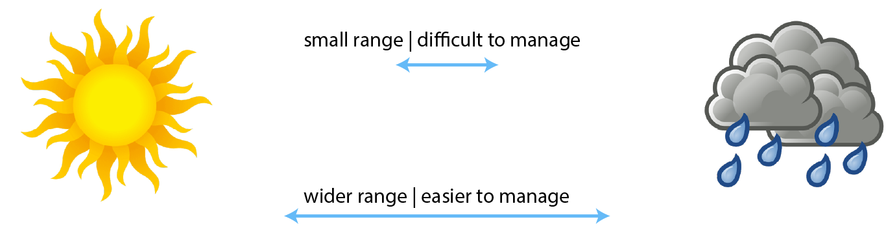
```

- changing $w$ or $\theta$ due to weather 

- brittle & hard vs. soft & unstable 

- $\theta_{crit}$ ?


---

# Current ideas

```{r current-DuraEdge-ideas, out.width="70%"}
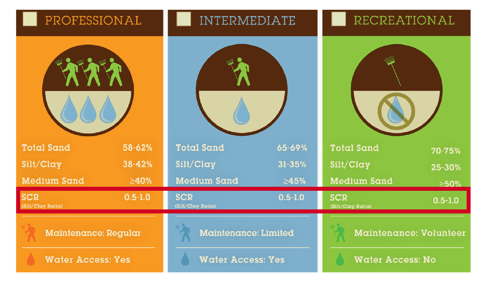
```

.footnote[Credit: DuraEdge Products]

---

class: center, middle, x3

_What happens to the soil when it gets wet?_

---


# Field vs. lab?


.center.middle.x2[

Repeatability   
<br>
Speed  
<br> 
Cost

]

---

# Research objectives


.pull-left[

1. Create a laboratory method to identify critial &Theta; for any soil

2. Apply the method to compare experimental soil mixtures


]


.pull-right[

```{r}
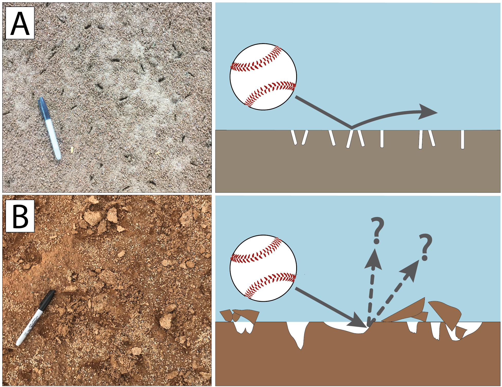
```

]

---


# Hypothesized soil response

```{r, out.width='80%'}
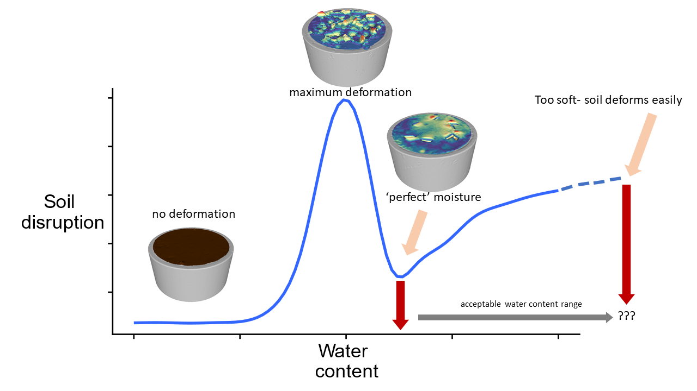
```


---


# Preparing the samples 

```{r, out.width = '60%'}
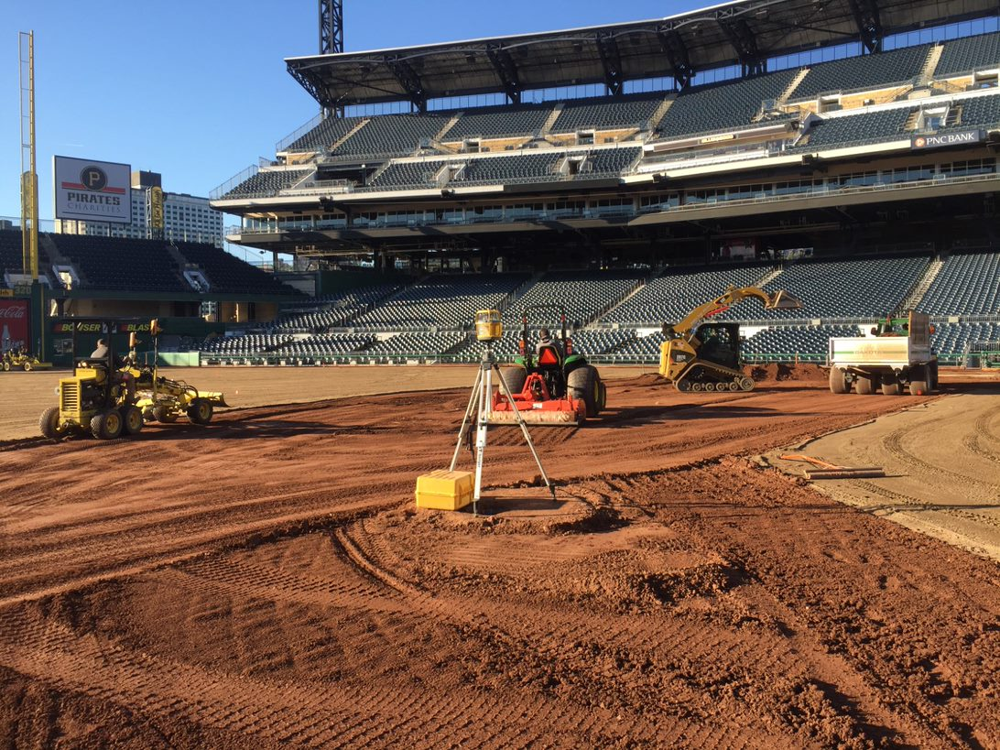
```

---


background-image: url('presentation-figs/effort-comparison-cf-PNC-density.png')
background-size: contain


---


background-image: url('presentation-figs/mod-effort-with-w-opt-annotation.png')
background-size: contain


---

class: middle


.pull-left[

```{r}
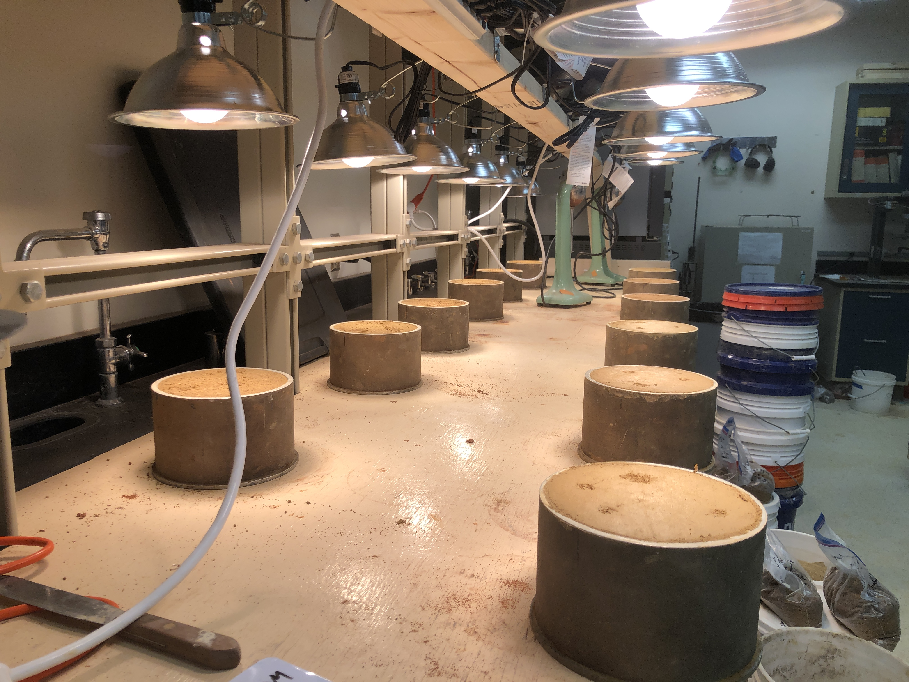
```


]

.pull-right[

```{r}
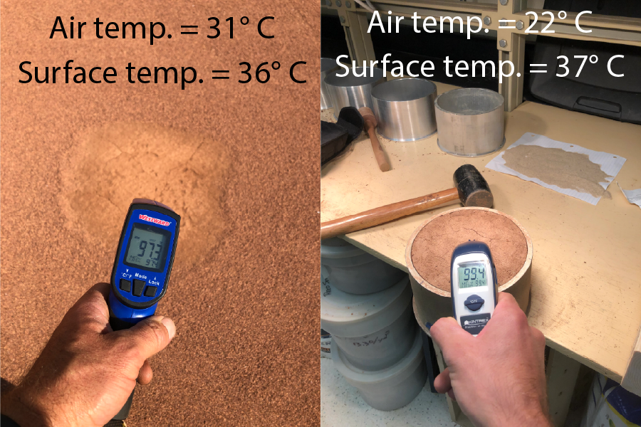
```


]

---


background-image: url('presentation-figs/w-variation-across-space-and-time.png')
background-size: contain


---

background-image: url('presentation-figs/cleat-mark-device-on-lab-bench.png')
background-size: contain

---

background-image: url('presentation-figs/cleat-mark-device-plate-underside.jpg')
background-size: contain


---


# 3D surface mapping

```{r, out.width='60%'}
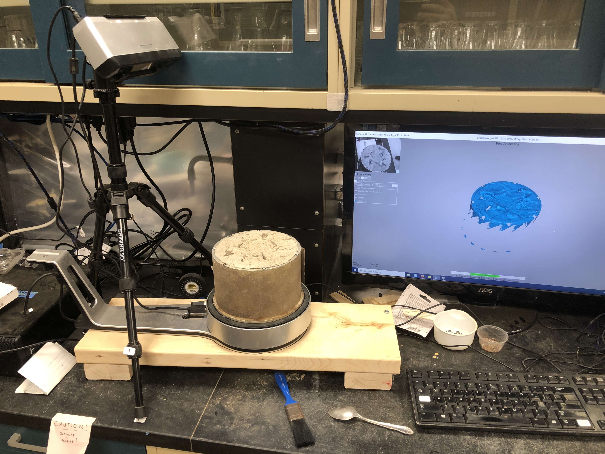
```


---
class: no-h1
background-image: url('presentation-figs/example-high-medium-low-dne-meshes.png')
background-size: contain
# Example meshes 


---


# Results 

- Three clay soils mixed w/ 50-80% sand

- Four 60-20-20 mixes (i.e. 60% sand and SCR = 1)

---
class: no-h1
background-image: url('presentation-figs/prelim-dne-facets-by-clay-type-and-sand-pct.png')
background-size: contain
# "Pure" clay mixes @ various sand contents


---

class: no-h1
background-image: url('presentation-figs/pure-clays-derived-theta-crit-values.png')
background-size: contain
# Derived theta crit values for 'pure' clay mixes 


---


class: white-bg

# Clay type &times; sand content interaction 

.center[


```{r}
source(here::here('supplemental_R_scripts/spline-interaction-significance-for-ASA-2021.R'))

options(knitr.kable.NA= "-")
kableExtra::kbl(
  x = interaction_anova_kbl,
  # format = "latex",
  booktabs = TRUE,
  # caption = 'Clay type x sand % interaction',
  escape = T
) %>% 
  kableExtra::row_spec(row = 0, bold = TRUE) %>% 
  kableExtra::row_spec(row = 4, bold = TRUE, background = gplots::col2hex('goldenrod2')) %>% 
  kableExtra::kable_styling()

```


]


- Physical meaning?


???

Physical meaning: blanket recommendation for sand content re: maintenance not adequate


---

class: no-h1
background-image: url('presentation-figs/four-60-20-20-dne-vs-vwc-curves.png')
background-size: contain

# 60-20-20 mixes

---


# Summary 

--


- $\theta_{crit}$ for any soil

--


- Both clay type _and_ sand content affect $\theta_{crit}$ 

--


- mixes w/ same % sand and SCR perform differently....

--


___


- Follow along at  [evan-soil.io](https://www.evan-soil.io) and  [@argil_acharya](https://www.twitter.com/argil_acharya)


---

class: middle, center


# Thank you ! 


---


# Extras 

---
background-image: url('presentation-figs/hypothetical-stress-strain-curves.png')
background-size: contain
# Toughness concept 


---


# Toughness hypotheses

- mixes w/ same % sand and SCR perform differently....

- mixes w/ _different_ sand % and different clays perform _similarly_

- therefore, can't start w/ % sand.....must start with mineralogy/toughness

- increase or reduce toughness by altering sand content

- adding silt will reduce performance for _all_ clays

- interpolate desired toughness based on shape of toughness vs. % sand curve


---


background-image: url('committee-meeting-2-presentation-dependencies/daily-specimen-repairs-panels.png')
background-size: contain

---


class: no-h1
# Actuating the device 

<div style="padding:56.25% 0 0 0;position:relative;"><iframe src="https://player.vimeo.com/video/572140447?badge=0&amp;autopause=0&amp;player_id=0&amp;app_id=58479" frameborder="0" allow="autoplay; fullscreen; picture-in-picture" allowfullscreen style="position:absolute;top:0;left:0;width:100%;height:100%;" title="cleat-mark-device-actuation"></iframe></div><script src="https://player.vimeo.com/api/player.js"></script>

---


# Future directions


- toughness of mixtures at critical $\theta$


--


- continue manipulating SCR 

--


- sand types

--


- clay mixtures?


---

class: no-h1

background-image: url('committee-meeting-2-presentation-dependencies/R-mesh-processing-pipeline.png')
background-size: contain

# Automated mesh processing with R 

---

# Dirichlet normal energy

.pull-left[

- surface complexity

- higher "energy" means further from horizontal plane

- **molaR** package - primate teeth [(Pampush, 2020)](https://cran.r-project.org/web/packages/molaR/index.html)

]


.pull-right[

```{r}
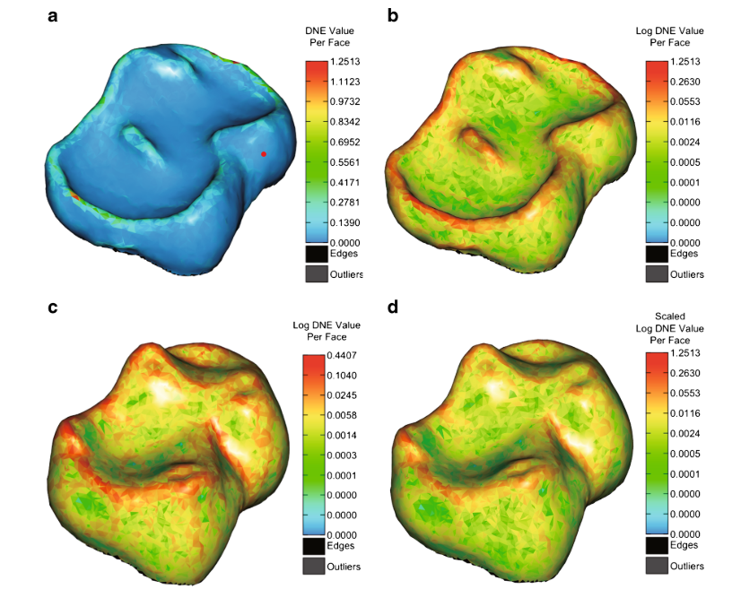
```

]

---

# Water content 

- &Theta; computed from 3D scanning & weighing 

```{r out.width='50%'}
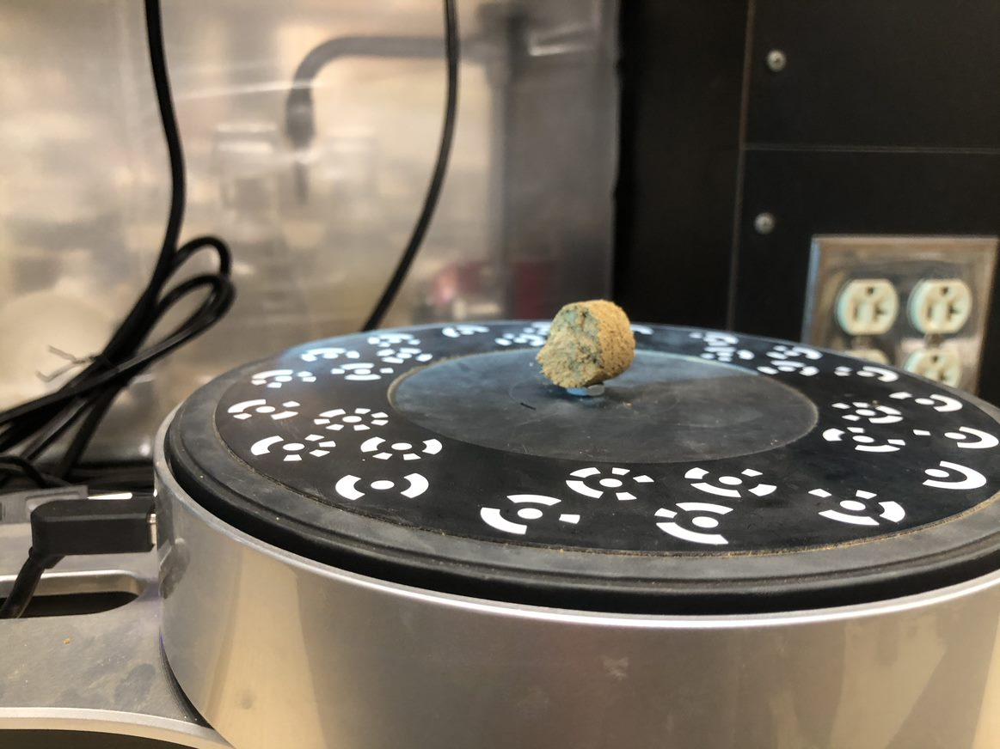
```


---