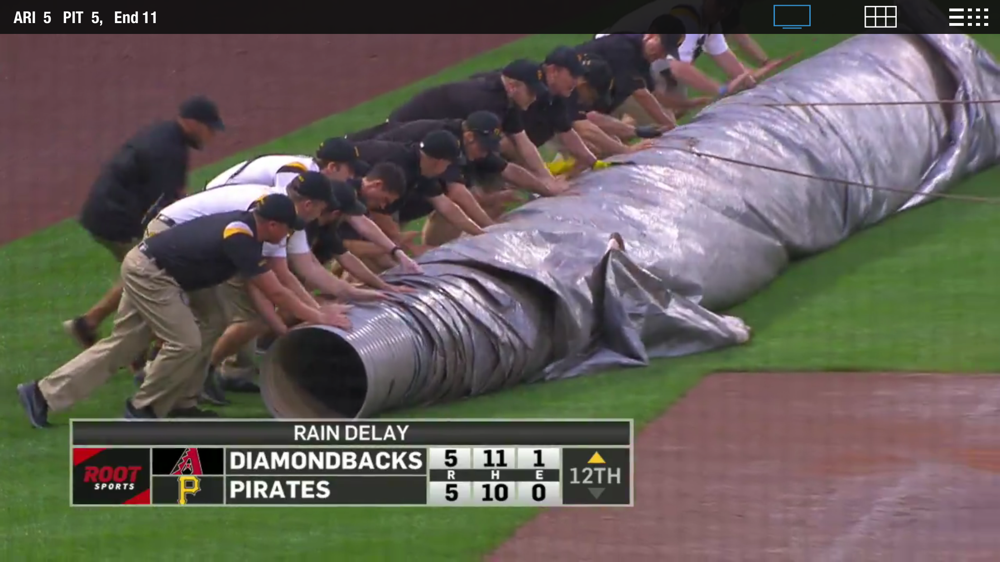
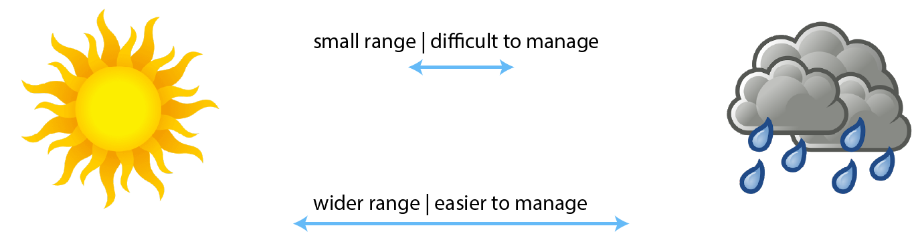
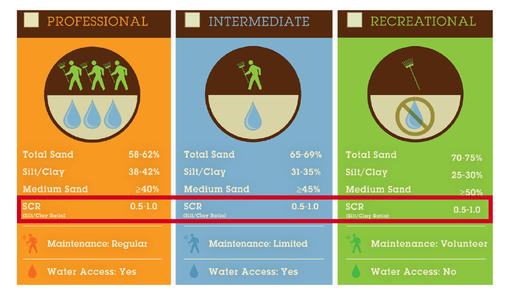

background-image: url('https://drive.google.com/uc?id=1hFX3lZCMW5kAI1y1E577UpdmSvo8wyoF')
background-size: contain

```{r setup, include=FALSE}
knitr::opts_chunk$set(echo = F, warning = F, message = F, out.width = "90%", fig.align = 'center')
library(magrittr)
library(xaringanExtra)
xaringanExtra::use_tile_view()
xaringanExtra::use_scribble()
xaringanExtra::use_search(show_icon = TRUE, case_sensitive = FALSE, auto_search = TRUE, position = "top-right")
```

.pull-left[

# Structure

- Problem review (~5 min)

- Method development &   proof-of-concept data (~15 min)

- Proposed experiments (~10 min)

- Discussion (~30 min)

]

--

.pull-right[

# Main topics to visit

- mineral ID & selection of clays

- curve fitting/segmented regression

- "replications" over multiple days 

- maximizing return on data collection 

]

---
class: no-h1
background-image: url('presentation-figs/player-locations.png')
background-size: contain

# Concentration of play 

---
background-image: url('committee-meeting-2-presentation-dependencies/corkboard-concept.png')
background-size: contain


class: no-h1
# Cleat-in/cleat-out


---
class: no-h1, middle, center

# Managing water content 

.pull-left[

```{r post-game-soak, out.width='100%'}
knitr::include_graphics('committee-meeting-2-presentation-dependencies/post-game-soak.JPG')
```

]

.pull-right[

```{r in-game-tarp-pull, out.width='100%'}

```


]

---

# Acceptable boundaries 

```{r}

```

- changing $w$ or $\theta$ due to weather 

- brittle & hard vs. soft & unstable 

- $\theta_{crit}$ ?


---

# Current ideas

```{r current-DuraEdge-ideas, out.width="80%"}

```

---


# Method development

.pull-left[

.middle[

```{r newton-image, out.width="90%"}
knitr::include_graphics('./committee-meeting-2-presentation-dependencies/newton-transparent.png')
```

]
]

.pull-right[
.middle[
.dark-grey[
>_"I asked him where he had it made, and he said he made it himself._   
>
>_When I asked him where he got his tools, he said he made them himself, and laughing added 'if I had staid for other people to make my tools & things for me, I had never made anything...'"_

]
]
]


---

# Cleat-mark test 

.pull-left[

- goal is to derive $\theta_{crit}$ for any soil

- serves as lower boundary of desirable state 

- must replicate outdoor conditions 

]

.pull-right[

```{r}
knitr::include_graphics('committee-meeting-2-presentation-dependencies/corkboard-concept.png')
```


]


---
background-image: url('presentation-figs/hypothetical-stress-strain-curves.png')
background-size: contain
# Toughness concept 

```{r}
# 
```


---

background-image: url('presentation-figs/specimen-preparation-process-panels.png')
background-size: contain
# Cleat-mark test: preparing the samples 

???

- first mix components 

- perform proctor test; bring to $w_{opt}$; compact 

- soak and dry under lamps 


---


.pull-left[

```{r}
knitr::include_graphics('committee-meeting-2-presentation-dependencies/corkboard-concept.png')
```


]


.pull-right[

```{r}
knitr::include_graphics('committee-meeting-2-presentation-dependencies/corkboard-concept.png')
```


]

---

background-image: url('presentation-figs/cleat-mark-device-on-lab-bench.png')
background-size: contain

---

class: no-h1
# Actuating the device 

<div style="padding:56.25% 0 0 0;position:relative;"><iframe src="https://player.vimeo.com/video/572140447?badge=0&amp;autopause=0&amp;player_id=0&amp;app_id=58479" frameborder="0" allow="autoplay; fullscreen; picture-in-picture" allowfullscreen style="position:absolute;top:0;left:0;width:100%;height:100%;" title="cleat-mark-device-actuation"></iframe></div><script src="https://player.vimeo.com/api/player.js"></script>

---

class: no-h1
background-image: url('committee-meeting-2-presentation-dependencies/iphone-3d-scans.png')
background-size: contain

# Crude iPhone scans

???

- image of Drohan scanner samples 

- and finally our scanner 

- explain difficulty in obtaining fast and high-quality scans (lighting, angles, reflection)

- then the orientation and processing pipeline 

---

```{r, message=FALSE, warning=FALSE, results='asis'}
hypothetical_deformation_vs_w_slides <- list.files(
  path = 'committee-meeting-2-presentation-dependencies/hypothetical-deformation-vs-w-curves/', 
# if including all the incremental slides  pattern = "[^67]\\.png$",
 pattern = "8\\.png$", # if inlcuding just one 
  full.names = T, 
  ignore.case = TRUE)

for (i in hypothetical_deformation_vs_w_slides) {
  cat("\n", "background-image: url('", i, "')", "\n", sep = "")
  cat("background-size: contain", "\n", sep = " ")
  cat("\n---\n")
}

```


# Mesh processing

- A long battle

- 2 phases: 

  - Pre-processing 

  - Metric computations 

???

You can find lots of papers with equations describing the mathematics which underpin their measurements, but very little practical guidance about how to calculate them 

---

background-image: url("committee-meeting-2-presentation-dependencies/images_16x9_ratio/unprocessed_cylinder_16x9.png") 
background-size: contain
# Alignment 

---

background-image: url("committee-meeting-2-presentation-dependencies/scanner-setup.png") 
background-size: contain

---

background-image: url("committee-meeting-2-presentation-dependencies/images_16x9_ratio/from_scanner_coodinate_system_16x9.png")
background-size: contain
# Alignment

---

class: no-h1
# Manual processing with MeshLab

<div style="padding:56.25% 0 0 0;position:relative;"><iframe src="https://player.vimeo.com/video/571753999?badge=0&amp;autopause=0&amp;player_id=0&amp;app_id=58479" frameborder="0" allow="autoplay; fullscreen; picture-in-picture" allowfullscreen style="position:absolute;top:0;left:0;width:100%;height:100%;" title="meshlab-point-and-click-workflow-recording_2021-07-06"></iframe></div><script src="https://player.vimeo.com/api/player.js"></script>


---
class: no-h1
# Automated processing with R 

<div style="padding:56.25% 0 0 0;position:relative;"><iframe src="https://player.vimeo.com/video/571779932?badge=0&amp;autopause=0&amp;player_id=0&amp;app_id=58479" frameborder="0" allow="autoplay; fullscreen; picture-in-picture" allowfullscreen style="position:absolute;top:0;left:0;width:100%;height:100%;" title="R-mesh-processing-workflow"></iframe></div><script src="https://player.vimeo.com/api/player.js"></script>

---
background-image: url('committee-meeting-2-presentation-dependencies/finished-R-video-screenshot.png')
background-size: contain


---
background-image: url('committee-meeting-2-presentation-dependencies/R-mesh-processing-pipeline.png')
background-size: contain


class: no-h1
# Completed pipeline

---

# Summary: pre-processing

- Longer than expected 

- Faster & reproducible 

- ~ 95% reduction in time required to obtain a single measurement

<hr>

--
# Surface properties derived from mesh 

- volume 

- surface energy 


---

background-image: url('presentation-figs/top-view-plan-view-combined.png')
background-size: cover

---

class: no-h1 
background-image: url('committee-meeting-2-presentation-dependencies/sand-backfill-process.JPG')
background-size: contain

# Volume methods: sand backfill


---

background-image: url('committee-meeting-2-presentation-dependencies/big-cleat-marks-sand-backfill.JPG')
background-size: contain
class: no-h1 
# Volume methods: sand backfill


---

background-image: url('presentation-figs/rasterized-cyl01_2021-04-11.png')
background-size: contain

---

background-image: url('committee-meeting-2-presentation-dependencies/physical-vs-scanner-volumes.png')
background-size: contain
class: no-h1 
# Volume methods: sand backfill


---

# Dirichlet normal energy

.pull-left[

- surface complexity

- higher "energy" means further from horizontal plane

- **molaR** package - primate teeth

]


.pull-right[

```{r}
knitr::include_graphics('committee-meeting-2-presentation-dependencies/dne-image-from-pampush-paper.png')
```

]

---

background-image: url('committee-meeting-2-presentation-dependencies/ductile-dne-3d.png')
background-size: contain

##  DNE =  4,400


---


background-image: url('committee-meeting-2-presentation-dependencies/brittle-dne-3d.png')
background-size: contain
##  DNE =  5,900

---

# Water content 

(skip over for now; return later if time )

- $\theta$ computed from 3D scanning & weighing 

---

# Finally, some data 

\- 5 clay soils; all mixed to 60% sand 

\- fully compacted, tested over successive days

---

```{r include=FALSE}
old_clays_curves <- "E:/onedrive-psu/PSU2019-present/A_inf_soils_PhD/SelectingClaysJan2021/figs/png/5-clays-curves.png"

new_clays_curves <- here::here('presentations', 'committee-meeting-2-presentation-dependencies', basename(old_clays_curves))

if(file.mtime(old_clays_curves) > file.mtime(new_clays_curves)){file.copy(old_clays_curves, new_clays_curves, overwrite = T)}
```


background-image: url('committee-meeting-2-presentation-dependencies/5-clays-curves.png')
background-size: contain

--

```{r hypothetical-curve-thumbnail, out.width='40%', fig.align='center'}
#

magick::image_read('committee-meeting-2-presentation-dependencies/hypothetical-deformation-vs-w-curves/Slide7.png') %>% 
  magick::image_border(color = 'black', geometry = '10x10')

```

]

---


```{r include=FALSE}
old_clays_dotplot <- "E:/onedrive-psu/PSU2019-present/A_inf_soils_PhD/SelectingClaysJan2021/figs/png/theta-crit-dotplot-5-clays.png"

new_clays_dotplot <- here::here('presentations', 'committee-meeting-2-presentation-dependencies', basename(old_clays_dotplot))

if(!file.exists(new_clays_dotplot) | file.mtime(old_clays_dotplot) > file.mtime(new_clays_dotplot)){file.copy(old_clays_dotplot, new_clays_dotplot, overwrite = T)}
```


background-image: url('committee-meeting-2-presentation-dependencies/theta-crit-dotplot-5-clays.png')
background-size: contain


---

# Future experiments & material selection 

- Choose mixtures carefully 

- Range of particle sizes, mineralogy, AND plasticity/toughness

- Adjust SCR by adding pure Qz silt

.middle[

```{r planned-scr-values}

scr_possible_vals <- readr::read_rds(
  "E:/onedrive-psu/PSU2019-present/A_inf_soils_PhD/SelectingClaysJan2021/analysis/data/derived-data/5-clays-silt-and-clay-fractions.rds"
)

scr_kable <- scr_possible_vals %>% 
  kableExtra::kbl(align = 'lcccc', format = 'html',
                  col.names = c(
                    'Sample name',
                    '% Sand-size',
                    '% Silt-size',
                    '% Clay-size',
                    'SCR')
                  ) %>% 
  kableExtra::row_spec(0, bold = TRUE) %>% 
  kableExtra::kable_styling()
  

scr_kable

```


]

???

- Several days of testing per mix

- collecting the data is a lot of work so choosing the right materials to test is VERY important 

---


```{r find-xrd-plots}
# a no-no to hard-code paths but in this case I think 
# it's the easiest, to ensure the code stays linked to the updated 
# versions of the figures 
all_original_xrd_patterns <- list.files(path = "E:/onedrive-psu/PSU2019-present/A_inf_soils_PhD/SelectingClaysJan2021/figs/summer-2021-xrd-patterns/", full.names = TRUE, pattern = "\\.png$", ignore.case = TRUE)

# copy the files if they are newer 

new_xrd_paths <- here::here(
  fs::path(
  'presentations',
  'presentation-figs',
  'summer-2021-xrd-patterns',
  basename(all_original_xrd_patterns))
)

copying_args <- tibble::tibble(
  old_path = all_original_xrd_patterns,
  old_mtime = file.mtime(all_original_xrd_patterns),
  new_path  = new_xrd_paths,
  new_mtime  = file.mtime(new_path),
  copy = !file.exists(new_path) | old_mtime > new_mtime
) %>% 
  dplyr::filter(copy)

fs::file_copy(copying_args$old_path,
              copying_args$new_path,
              overwrite = TRUE)

all_xrd_paths <- list.files(
  path = 'presentation-figs/summer-2021-xrd-patterns/',
  pattern = "\\.png$",
  ignore.case = TRUE,
  full.names = TRUE)

```

```{r coarser-clay-xrd-plots, message=FALSE, warning=FALSE, results='asis'}

coarser_clay_xrd_plots <- all_xrd_paths[!stringr::str_detect(all_xrd_paths, "minus-0\\.2")]

for (i in coarser_clay_xrd_plots) {
  cat("\n---\n")
  cat("\n", "background-image: url(\"", i, "\")", "\n", sep = "")
  cat("background-size: contain", "\n", sep = " ")
  }
```


---

# Broad hypotheses 

1. Sand % + SCR not sufficient to fully predict soil behavior

  - soils w/ **same** sand % and SCR can behave differently
  
  - soils w/ **different** sand % or SCR can behave similarly

2. Desirable $\theta$ range extensible with higher-plasticity clays

3. Increases in silt will diminish performance as measured by toughness at $\theta_{crit}$ and by total useful $\theta$ range 


<!-- # Toughness hypotheses  -->

<!-- - mixes w/ same % sand and SCR perform differently.... -->

<!-- - mixes w/ different SCR perform similarly... -->

<!-- - therefore, can't start w/ % sand.....must start with mineralogy/toughness  -->

<!-- - increase or reduce toughness by altering sand content  -->

<!-- - adding silt will reduce performance for _all_ clays -->

<!-- - interpolate desired toughness based on shape of toughness vs. % sand curve  -->

---

# Discussion topics

- mineral ID & selection of clays

- curve fitting/segmented regression

- "replications" over multiple days 

- maximizing return on data collection 

- ??


---

# Extras 

---


# All XRD patterns 

```{r, all-xrd-plots, message=FALSE, warning=FALSE, results='asis'}

for (i in all_xrd_paths) {
  cat("\n---\n")
  cat("\n", "background-image: url(\"", i, "\")", "\n", sep = "")
  cat("background-size: contain", "\n", sep = " ")
  }

```

---

# "Guts" of a `.ply` file

<iframe src="committee-meeting-2-presentation-dependencies/example-mesh-ascii-ply.txt" style="margin-left:auto; margin-right:auto; display:block; width:70%; height:400px" ></iframe>


---

background-image: url('committee-meeting-2-presentation-dependencies/dodecahedron-w-normals.png')
background-size: contain

## Vertex normals 

---

class: full-screen-image
background-image: url("committee-meeting-2-presentation-dependencies/images_16x9_ratio/point_cloud_16x9.png")
background-size: contain

## More 3D mesh anatomy 

---

class: full-screen-image
background-image: url("committee-meeting-2-presentation-dependencies/images_16x9_ratio/wiremesh_16x9.png")
background-size: contain

## More 3D mesh anatomy 

---

class: full-screen-image
background-image: url("committee-meeting-2-presentation-dependencies/images_16x9_ratio/brittle_surface_16x9.png")
background-size: contain

## More 3D mesh anatomy 

---

class: full-screen-image
background-image: url("committee-meeting-2-presentation-dependencies/images_16x9_ratio/annotated_zoomed_16x9.png")
background-size: contain

## More 3D mesh anatomy 

---

background-image: url("committee-meeting-2-presentation-dependencies/images_16x9_ratio/annotated_example_meshes_16x9.png")
background-size: contain
class: no-h1

# Annotated example meshes from Drohan scanner

---


class: no-h1
background-image: url('committee-meeting-2-presentation-dependencies/sand-pcts-to-choose.png')
background-size: contain

# Sand percents to choose

---


# Water content 

(skip over for now; return later if time )
$w$ or $\theta$ ??

$\theta = w~\cdot~\rho_{~bulk}$

--

\- lack of dimensional stability

--

\- repairs normally occur _just_ wet-of-optimum

--

\- density @ test time likely &ne; initial preparation

--

## - Therefore:
Density at initial preparation may not be reflected in subsequent days of testing.

---

```{r, message=FALSE, warning=FALSE, results='asis'}
mini_density_images <- list.files(path = 'committee-meeting-2-presentation-dependencies/photos-and-screen-recordings/mini-density/', full.names = T, recursive = FALSE)

for (i in mini_density_images) {
  cat("\n---\n")
  cat("\n", "background-image: url(\"", i, "\")", "\n", sep = "")
  cat("background-size: contain", "\n", sep = " ")
}

```


background-image: url('presentation-figs/mini-plug-density-comp.png')
background-size: contain

---

background-image: url('committee-meeting-2-presentation-dependencies/daily-specimen-repairs-panels.png')
background-size: contain

---