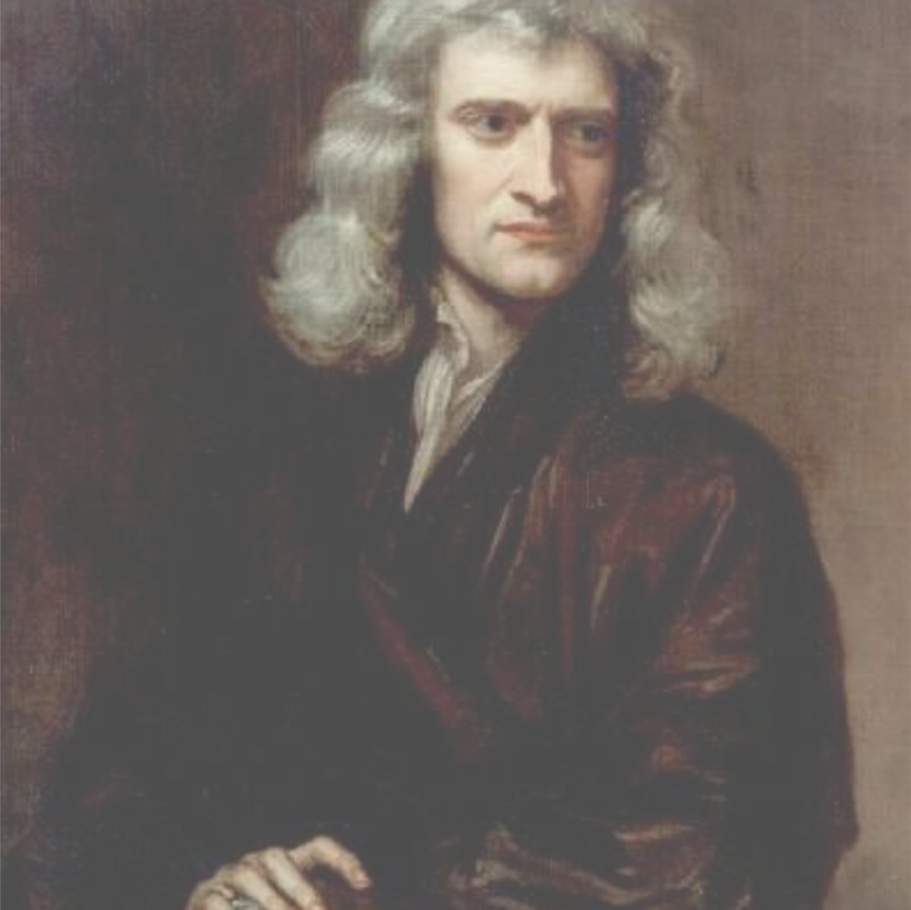

```{r setup, include=FALSE}
knitr::opts_chunk$set(echo = F, warning = F, message = F, out.width = "90%", fig.align = 'center')
library(magrittr)
```


---
class: no-h1

# Starting from scratch

<br>

.pull-left[
.middle[
.dark-grey[
>_"I asked him where he had it made, and he said he made it himself._   
>
>_When I asked him where he got his tools, he said he made them himself, and laughing added 'if I had staid for other people to make my tools & things for me, I had never made anything...'"_

]
]
]

.pull-right[

.middle[

```{r newton-image, out.width="90%"}

```

]

]

---
background-image: url('https://drive.google.com/uc?id=1hFX3lZCMW5kAI1y1E577UpdmSvo8wyoF')
background-size: contain
# Structure 

- Problem review (~5 min)

- Method development & data (~15 min)

- Upcoming experiments (~10 min)

---

background-image: url('committee-meeting-2-presentation-dependencies/corkboard-concept.png')
background-size: contain


class: no-h1
# Cleat-in/cleat-out


---

# Acceptable boundaries 

- brittle & hard vs. soft & unstable 

- changing $w$ or $\theta$ due to weather 

--

```{r}
knitr::include_graphics('./committee-meeting-2-presentation-dependencies/water-content-ranges.png')
```


---
- same soil, from wet to dry

- across soils? 

- $\theta_{crit}$ ?


---
# PSA is king (for now)

---
# Method development 

- what didn't work

- what is working 

---
background-image: url('committee-meeting-2-presentation-dependencies/cleatmark-device-low-res.png')
background-size: contain

- add image of iPhone scan
---

- image of Drohan scanner samples 

- and finally our scanner 

- explain difficulty in obtaining fast and high-quality scans (lighting, angles, reflection)

- then the orientation and processing pipeline 

---
class: no-h1
# Manual processing with MeshLab

<div style="padding:56.25% 0 0 0;position:relative;"><iframe src="https://player.vimeo.com/video/571753999?badge=0&amp;autopause=0&amp;player_id=0&amp;app_id=58479" frameborder="0" allow="autoplay; fullscreen; picture-in-picture" allowfullscreen style="position:absolute;top:0;left:0;width:100%;height:100%;" title="meshlab-point-and-click-workflow-recording_2021-07-06"></iframe></div><script src="https://player.vimeo.com/api/player.js"></script>


---
class: no-h1
# Automated processing with R 

<div style="padding:56.25% 0 0 0;position:relative;"><iframe src="https://player.vimeo.com/video/571779932?badge=0&amp;autopause=0&amp;player_id=0&amp;app_id=58479" frameborder="0" allow="autoplay; fullscreen; picture-in-picture" allowfullscreen style="position:absolute;top:0;left:0;width:100%;height:100%;" title="R-mesh-processing-workflow"></iframe></div><script src="https://player.vimeo.com/api/player.js"></script>

---
background-image: url('committee-meeting-2-presentation-dependencies/finished-R-video-screenshot.png')
background-size: contain


---
background-image: url('committee-meeting-2-presentation-dependencies/R-mesh-processing-pipeline.png')
background-size: contain


class: no-h1
# Completed pipeline


---

all told, about a 90% reduction in time required to obtain a single measurement

---

background-image: url('committee-meeting-2-presentation-dependencies/daily-specimen-repairs-panels.png')
background-size: contain

- sample preparation routines (compaction protocols and repairs)


---

measuring the water content accurately; $w$ vs $\theta$

---


even with these improvements it is a full day; need several data points to define curve 

therefore must choose mixtures very carefully to represent as broad a spectrum of potential clays as possible 
---

- finally, some data 


---
background-image: url('committee-meeting-2-presentation-dependencies/5-clays-curves.png')
background-size: contain

---

future experiments 

---

class: no-h1
background-image: url('committee-meeting-2-presentation-dependencies/sand-pcts-to-choose.png')
background-size: contain
exclude: true

# Sand percents to choose
---

# Representative materials

- goal is to have a range of particle sizes, mineralogy, AND plasticity/toughness
- adjust SCR by adding pure Qz silt

.middle[

```{r planned-scr-values}

scr_possible_vals <- tibble::tibble(
  `Clay name` = c('Calcium montmorillonite', 'Mixed-layer/illite-dominated', 'Fine-grained kaolinite', 'Fe-oxide rich', 'High-silt soil'),
  # clay_pct = format(c(0.6, 0.5, 0.8, 0.7, 0.15), digits = 2),
  # silt_pct = format(1- as.numeric(clay_pct), digits = 2),
  clay_pct = format(100*c(0.6, 0.5, 0.8, 0.7, 0.15), digits = 0),
  silt_pct = format(100- as.numeric(clay_pct), digits = 0),
  scr = format(as.numeric(silt_pct) / as.numeric(clay_pct), digits = 2)
  ) %>% 
  dplyr::arrange(scr) %>% 
  dplyr::rename(
    `% Clay-size` = clay_pct,
    `% Silt-size` = silt_pct,
    `Silt-to-clay ratio` = scr
  )

scr_possible_vals %>% 
  kableExtra::kbl(align = 'lccc',
                  booktabs = TRUE,
                  digits = 2,
                #caption = 'The 5 soils from Experiment 1 have different silt-to-clay ratios; silt can be added to produce soils with equivalent SCR values but different clay minerals and clay particle sizes. High-silt soils cannot be tested at an SCR lower than their existing value.',
                #caption.short = 'Adjusted silt-to-clay ratios of "pure" clays'
                ) %>% 
  kableExtra::row_spec(0, bold = TRUE) %>% 
  # kableExtra::add_header_above(header = c(' ' = 1, 'Approximate particle-size parameters' = 3)) %>% 
  kableExtra::kable_styling()
  
```

]

???

collecting the data is a lot of work so choosing the right materials to test is VERY important 

---

# Toughness hypotheses 


